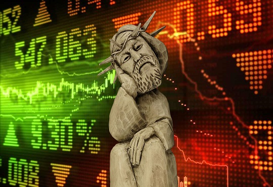

# Šūdų ekonomika: kaip virėjos tampa investuotojomis

###### Slaptasis protokolas 1: Įvadas

Gyvename laikais ekonomikos, kuri neveikia taip, kad būtų kažkoks bent kiek panašus į realybę mokslas, ją aprašantis. Ekonomistai nieko negali pasakyti, kas įvyks net per šiuos metus, nekalbant apie tai, kas bus toliau.

[2019 m. sausio 5-os dienos straipsnyje iš The Economist](https://www.economist.com/finance-and-economics/2019/01/05/what-the-market-turmoil-means-for-2019) (sausio 5, berods) galima rasti dvi frazes.

Economists at J.P. Morgan have developed a model based only on the historical predictive power of the stockmarket, credit spreads and the yield curve; that implies the probability of a recession in America in 2019 is as high as 91%.

A different model built by J.P. Morgan analysts, this time based on short-term economic indicators such as car sales, building permits and the unemployment rate, put the probability of recession in 2019 much lower, at 26%.

Ir abi frazės yra tame pačiame straipsnyje. Ir apie tą pačią kompaniją - J.P. Morgan, turinčią autoritetą pasaulyje. Jos reitingais naudojasi rimti investuotojai, investuojantys tavo pinigus. (Tiksliau, jie priverčia jaustis tave investuotoju, bet perka ir parduoda vertybinius popierius jie.)

Skirtumas tarp 26 ir 91 procentų yra pakankamai didelis, kad padaryti išvadą, kad tie ekonomistai visiškai neturi suvokimo, kaip šiais metais bus iš tikrųjų. Negi jie kvaili, nemokyti ar pan.? Juokauji, J.P. Morgan jiems gerai moka, ir daugelis jų yra iš prestižinių "Harvardų".

Kitas pavyzdys, arba dar viena ekonomikos mokslo parodija. Prieš krizes žinomi ekonomistai ginčijasi, ir negali sutarti, ar kažkas yra burbulas, ar ne. Po to, kai krizė įvyksta, išlenda koks nors ekonomikos profesorius, kuris pristato ekonominį-matematinį modelį, akivaizdžiai paaiškinantį, kodėl krizė įvyko, ir net kodėl ji turėjo įvykti. Už tokį savo nuopelną tas prof-drof gauna Nobelio premiją. Aplodismentai, ovacijos.

Dar vienas pavyzdys. Tave moko, kad gamintojas, sugebėjęs pagaminti prekę pigiau, ją parduos pigiau, taip rinkoje įgydamas konkurencinį pranašumą prieš kitus gamintojus. Kur tai veikia? Aš nežinau, nes matau reklamos stenduose: įsigyk suknelę tik už 14,95, batus už 39,99, automobilį už 14990. Ar esi matęs kainą 12,80 ar 27?

Be to, tave jau ilgai moko, kad yra kažkokia "laisva rinka", kuri automatiškai susireguliuoja, be jokių valstybės įsikišimų. Tik kažkodėl tos "laisvos rinkos" nėra išsivysčiose šalyse. Kiniečių fabrikai gamina, gamina amerikiečiams prekes, prikaupia kalnus dolerių, ir tada sako, laikas eiti į Ameriką apsipirkti. Mes norim, vat tą firmą nupirkti, nes ji turi mokslines laboratorijas ir rinką, kurios mes norim. O amerikiečiai - fig jums. Suorganizuoja komisijas valstybiniu mastu, nusprendžia, kad toks kompanijos nupirkimas yra grėsmė nacionaliniam saugumui ar panašių reikalų prigalvoja. Žodžiu, pasiimkit, kiniečiai tuos savo dolerius, ir džiovinkit toliau.

Taigi, ekonomikos mokslas neveikia arba veika gana prastai, kaip realius dalykus aprašantis mokslas o kodėl taip yra, bandysiu surašyti kitam slaptam protokole. Ar dar kitam...

###### Slaptasis protokolas 2: Matematika

Matematika atrodo toks baisus mokslas, kad net kyla diskusijos, gal vertėtų ją išmesti iš privalomųjų egzaminų, kad nekelti streso abiturientams.

Šiaip žmogus intuityviai supranta matematiką pakankamai gerai, bet išgirdęs formalią matematinę kalbą tiesiog nesupranta nieko. Išgirdęs tokį sakinį: "Dvinarė operacija * yra komutatyvi aibės S atžvilgiu, jei galioja lygybė x * y = y * x kiekvienam x ir y iš aibės S", turbūt išpūsi akis. Bet, jei mokytojas paaiškins, kad skaičių sudėtis tokia yra, nes ir prie vieno pridėjęs du, ir prie dviejų pridėjęs vieną gausi lygiai tą patį - tris. Ir dar, kad dalyba tokia nėra: 2:4 nera lygu 4:2. Taigi, 2 vaikams pasidalinti 4 obuolius yra ne tas pats, kas 4 vaikams pasidalinti 2 obuolius. Tada pasijusi gan neblogai suprantantis tą kom...kom...e-e-e...komutatyvumą. Jeigu tiksliųjų mokslų mokytojai ir dėstytojai savo teiginius iliustruotų paprastais pavyzdžiais, kaip lengvai mokiniai suprastų tai ir atsimintų!

Bet koks matematikos mokslas turi aksiomatiką, aksiomų rinkinį. O aksioma yra teiginys, kurio teisingumas priimamas be įrodymo. Čia kaip "Šventa Marija": reikia žinoti ir tiek. Ta aksiomatika yra detalių rinkinys universaliame konstruktoriuje. Iš tų detalių galima surinkti ir lėktuvėlį, ir traukinį. Bet koks matematikos mokslas turi savo aksiomatiką, kaip pagrindą, o kitus teiginius išveda iš to aksiomų rinkinio: įrodo, kad taip yra, arba taip nėra. Tiesa, tie įrodymai šiais laikais atrodo kaip gražių formulių seka, kuri normalų žmogų priverčia jaustis neišmanėliu. Taip nebuvo antikos Graikijoje. Jie tokių įmantrių simbolių formulėms užrašyti nežinojo, tai savo įrodymus turėjo aiškinti, mosuodami rankomis ir braižydami pagaliuku ant smėlio. Mokiniams tai suprasti būdavo kur kas paprasčiau. 

Dabar pažiūrim į tokį matematikos mokslą, kaip geometrija. Pagal pipipedijoje pateikiamą oficialų apibrėžimą "geometrija - tai anokia, esą matematikos sritis, bet dar iškreiptesnė, tai normalus žmogus paprastai joje nesigaudo". Nesusigaudo, tai nesusigaudo, bet visos geometrijos aš tau nepasakosiu. Tik noriu atkreipti dėmesį į vieną iš geometrijos aksiomų (Šventų Marijų). Ta aksioma sako maždaug šitai: jei turėsi du lygius vielos gabalus, ir juos abejose rankose laikysi arti vieną kito, tai jie nepalies vienas kito tik tada, jei rankos nedrebės. Tokią aksiomą galėjo sugalvoti tik senovės graikai, kurie gėrė tik vyną. Vėliau matematikas Lobačevskis, kuris rusišką degtinę gėrė, niekaip šio bandymo negalėjo pakartoti. Ir pasakė jis: "Nu chuj s nim, laikysiu vielas toliau vieną nuo kitos ir pakeisiu aksiomą taip, kad rankos gali šiek tiek drebėti".

Pala, pala... O kaip gražios formulės?.. Tada jis pabandė įrodyti tą ir aną, ir jo formulės gaudovasi lygiai tokios pat gražios. Jokių prieštaravimų jose nebuvo. Gavosi kitoks geometrijos mokslas, ir kaip vėliau paaiškėjo, jį, esant tam tikrom sąlygom net galima pritaikyti liaudies ūkyje.

Lietuvoje naujų Lobačevskių turbūt greitai neatsiras, nes vielos sunku rasti po 1993-1995 metalų karštinės. Apie tai atvirai užsimena ir mūsų širdžių prezidentas Vacys Maslionka savo Patreon paskyroje: "Paskutinį sykį taip smagiai 50 dolerių uždirbau 1994 metais, kai metalo supirkėjams už tokią  apvalią sumelę pardaviau visą ritinį iš fermos nupyzdintų varinių laidų". Bet išmokti Lobačevskio pamoką galima. Ir nereikia svarstyti, ar gera jo geometrija, ar ne, nes pagrindinis jo nuopelnas matematikai yra ne jo geometrija. O faktas, kad į aksiomatiką įmaišius "neteisingą" aksiomą, visas tas mokslas gali gautis matematiškai "teisingas" - nebus prie ko prisikabinti. Galimas atvejis, kad net padėjus blogus pagrindus, gausim matematiškai teisingą modelį. Ir formulės gausis gražios...

Dar gražiau gaunasi, kai tavo formulės yra gražios, kai tu šventai tiki savo aksiomatika ir įrodymais jos pagrindu, o žaidimo taisyklės pasikeičia. Pačio žaidimo metu. Jei šachmatų taisykles pakeisime taip, kad leisime didmeistriui pavogti bokštą, tai nesvarbu, kad mėgėjas visus ėjimus yra teisingai užsirašęs. "Kontora rašo!", tada atsako didmeistris, o mėgėjas pralaimi. Kaip visada.

----
Nuorodos:

https://lt.wikipedia.org/wiki/Komutatyvumas

https://lt.wikipedia.org/wiki/Aksioma

http://www.pipedija.com/index.php/Geometrija

https://www.patreon.com/maslionka

https://www.youtube.com/watch?v=YW4BaFTEgdM

###### Slaptasis protokolas 3: Kas, kaip ir kodėl?

Dar nesugalvojau, ką aš parašysiu, bet kažką parašysiu. Nes nėra to buvę, kad kažkas nebūtų.
